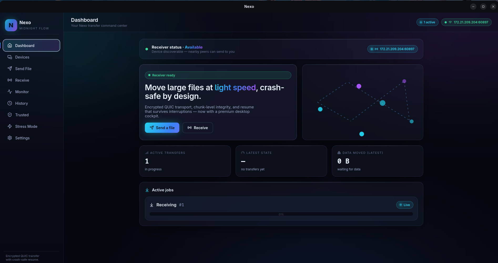

<div align="center">

# Nexo

### Fast, private, peer-to-peer file transfers without cloud storage

**Nexo lets you transfer files directly between your devices. Your files do not
live on a cloud server.** No uploads, no accounts, no size limits imposed by
someone else's disk — just an encrypted, direct connection from your device to
theirs.

[Install](#installation) · [Features](#features) · [How it works](#how-it-works) · [Screenshots](#screenshots)

</div>

---

## Why Nexo

Most "send a big file" tools upload your file to a company's servers first, then
give the other person a link to download it. Your file sits on someone else's
computer, often with a size cap and an expiry date.

Nexo doesn't do that. When you send a file, it goes **straight from your device
to the other device** over an encrypted connection. Nothing is uploaded to a
Nexo server — because there isn't one holding your files.

- **No upload servers.** Your files never touch our infrastructure.
- **Direct device-to-device transfer.** The bytes travel from you to them.
- **Encrypted.** The connection is end-to-end encrypted.
- **Resumes if interrupted.** Close your laptop mid-transfer? It picks up where
  it left off instead of starting over.

Think of it as **AirDrop for every platform** — for your own devices and the
people next to you.

## Features

- ✅ **Direct peer-to-peer transfers** — files go device to device, not through the cloud
- ✅ **End-to-end encrypted connections** — secured with modern encryption (QUIC / TLS 1.3)
- ✅ **Resume interrupted transfers** — a dropped connection continues, it doesn't restart
- ✅ **Large file support** — send multi-gigabyte files without a cloud size cap
- ✅ **LAN discovery** — nearby devices find each other automatically
- ✅ **Device trust** — remember and verify the devices you transfer with
- ✅ **Transfer approval** — both sender and receiver confirm every transfer
- ✅ **Background receiving** — stay ready to receive from the system tray
- ✅ **Cross-platform desktop app** — Linux and Windows (macOS coming later)

## Screenshots

> _Nexo desktop app — dark "Midnight Flow" theme._

| Dashboard | Send |
|---|---|
|  |  |

| Receive approval | Transfer progress |
|---|---|
|  |  |

| Settings |
|---|
|  |

_(Screenshots are added under [`docs/screenshots/`](docs/screenshots/); until then
the images above are placeholders.)_

## Installation

### Linux

Download from the [latest release](https://github.com/harshvardhandpu/nexo/releases):

- **AppImage** (works on any distro — no install, just run):
  ```bash
  chmod +x Nexo-linux.AppImage
  ./Nexo-linux.AppImage
  ```
- **`.deb`** (Debian / Ubuntu / Mint / Pop!_OS):
  ```bash
  sudo apt install ./Nexo-linux.deb
  ```

Full guide (dependencies, tray, autostart, troubleshooting):
**[docs/linux-install.md](docs/linux-install.md)**.

### Windows

**Recommended — installer:**

1. Download **`Nexo-windows.msi`** from the
   [latest release](https://github.com/harshvardhandpu/nexo/releases).
2. Run the installer. On the *"Windows protected your PC"* prompt (unsigned
   build), click **More info → Run anyway**.
3. Finish the install — Nexo adds a Start Menu entry, a desktop shortcut, and an
   uninstall entry.
4. Launch **Nexo** from the Start Menu.

**Requirements:** Windows 10 / 11 (64-bit) and the **WebView2 runtime** — already
present on Windows 11 and current Windows 10. If it's missing, the installer
downloads and installs it automatically (first install needs internet).

**Portable — no install:** prefer not to install? Download **`Nexo-portable.exe`**
from the release, double-click it, and Nexo launches. No terminal, no Rust, no
Node — just WebView2 (above). Your data still lives in `%APPDATA%\dev.nexo.desktop`.

Full guide (firewall, discovery, antivirus, VPN):
**[docs/windows-install.md](docs/windows-install.md)**.
Building on Windows: **[docs/windows-development.md](docs/windows-development.md)**.

### macOS

**Coming later.** macOS builds are on the roadmap but not available yet.

### Build from source

Prerequisites: [Rust](https://rustup.rs) (stable), [Node.js](https://nodejs.org)
≥ 18, and the platform build tools.

```bash
git clone https://github.com/harshvardhandpu/nexo
cd nexo/apps/desktop
npm install
npm run tauri dev            # run the app
npm run tauri build          # build an installer for your platform
```

Platform-specific setup:
- **Linux:** [docs/linux-install.md](docs/linux-install.md#building-from-source)
- **Windows:** [docs/windows-development.md](docs/windows-development.md) — Git,
  Rust (MSVC), Node, Visual Studio C++ build tools. Run
  `scripts/windows-check.ps1` to verify your environment first.

## How it works

Sending a file with Nexo is four simple steps — and your file never leaves your
control:

1. **Find** — open Nexo on both devices. On the same network, they discover each
   other automatically. (You can also type the other device's address.)
2. **Send** — pick the device and choose a file. You confirm you want to send it.
3. **Accept** — the other person sees an approval prompt with the file name and
   size, and clicks **Accept**. Nothing transfers until they agree.
4. **Transfer** — the file streams **directly** from your device to theirs, fully
   encrypted, and is verified for integrity on arrival. If the connection drops,
   it resumes automatically.

```
   Your device                                  Their device
 ┌─────────────┐   1. discover on the network  ┌─────────────┐
 │             │◀─────────────────────────────▶│             │
 │  2. send ──▶│   you confirm                 │             │
 │             │   3. they accept ◀────────────│  ✅ accept  │
 │   ═══════ encrypted direct transfer ═══════▶│  📄 file    │
 │             │   resumes if interrupted      │             │
 └─────────────┘                               └─────────────┘
         no cloud · no account · encrypted end to end
```

## Privacy & security

- Your files are transferred **directly** between devices and are **never**
  uploaded to a Nexo server.
- Connections are **end-to-end encrypted**.
- **Every** transfer requires approval from both the sender and the receiver.
  Auto-accepting from a device is optional, off by default, and only ever applies
  to devices you've explicitly trusted.

## Documentation

- [Install on Linux](docs/linux-install.md)
- [Install on Windows](docs/windows-install.md)
- [Build on Windows (developers)](docs/windows-development.md)
- [Release notes — v1.0.0](docs/release-notes-v1.0.0.md)
- [Nexo 2.0 roadmap — global share links](docs/roadmap/nexo-2-share-links.md)
- [Release checklist](docs/release-checklist.md)

For contributors, the `docs/` folder also covers the transport, protocol,
session layer, and transfer pipeline.

## Status

**Nexo 1.0.** Desktop app feature-complete: encrypted QUIC transfers, resume,
LAN discovery, device trust, sender/receiver approval, background receiver, tray,
notifications, onboarding, and packaged installers for Linux and Windows.

**Current limitation:** Nexo 1.0 transfers between devices on the **same local
network** (LAN). Sending to someone across the internet with a **share link** —
still direct peer-to-peer, still no cloud storage — is planned for **Nexo 2.0**
(see the [share-links roadmap](docs/roadmap/nexo-2-share-links.md)).

## License

See repository.
